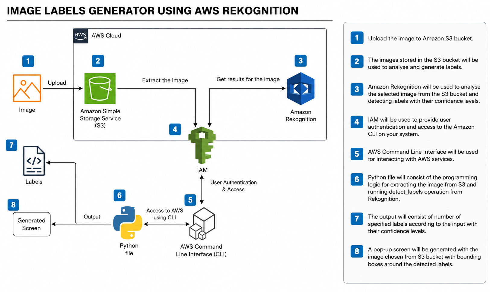
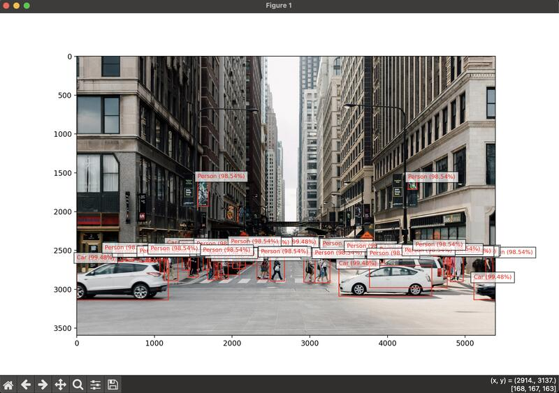
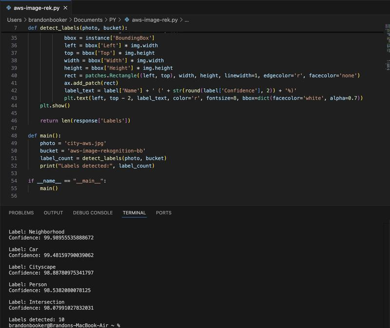
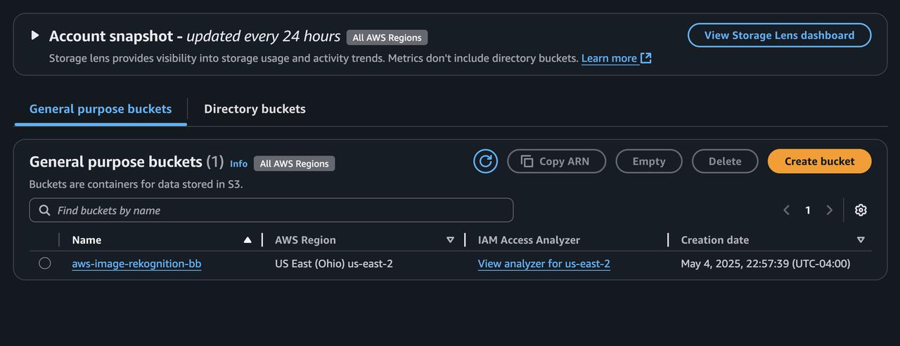
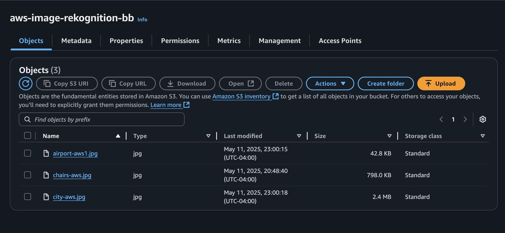

# AWS Image Label Generator with Amazon Rekognition

A Python-based computer vision application that leverages Amazon Rekognition to automatically detect, classify, and annotate objects within images stored in Amazon S3.

**Completed:** May'25


---

## Project Summary

This project demonstrates how to build an automated image recognition pipeline using **Python**, **Amazon Rekognition**, **Amazon S3**, and **Boto3**.

The application retrieves images stored in Amazon S3, sends them to Amazon Rekognition for analysis, and returns AI-generated labels with confidence scores. It also visualizes the results by drawing bounding boxes around detected objects, creating an intuitive representation of Rekognition's object detection capabilities.

This project highlights practical integration between AWS AI services and Python while following secure cloud development practices through IAM-authenticated API calls.

---
## Objective

I developed this project as part of my AWS cloud engineering portfolio to demonstrate practical experience integrating managed AI services with Python automation.

The solution showcases cloud-native development, secure AWS service integration, and computer vision concepts while emphasizing scalable, production-oriented design patterns.

---

## Features

- AI-powered object detection using Amazon Rekognition
- Detects multiple objects within a single image
- Returns confidence scores for every detected label
- Retrieves images directly from Amazon S3
- Uses Boto3 for secure AWS API interactions
- Draws bounding boxes around detected objects
- Displays labeled results using Matplotlib
- Built using AWS IAM authenticated requests

---

## Architecture




### Workflow

```
Amazon S3
      │
      ▼
Python Application
      │
      ▼
Amazon Rekognition DetectLabels API
      │
      ▼
Labels + Confidence Scores
      │
      ▼
Bounding Boxes + Image Visualization
```

---

## AWS Services Used

| Service | Purpose |
|----------|---------|
| Amazon S3 | Stores images for analysis |
| Amazon Rekognition | Performs object detection and image labeling |
| AWS IAM | Secure authentication and authorization |
| Boto3 | Python SDK for AWS service integration |

---

## Project Structure

```
aws-image-label-generator/
│
├── images/
│   ├── architecture-diagram.png
│   ├── sample-image.jpg
│   └── output.png
│
├── aws-image-rek.py
├── requirements.txt
└── README.md
```

---

## Technologies

- Python
- Amazon Rekognition
- Amazon S3
- Boto3
- AWS IAM
- Matplotlib
- Pillow (PIL)

---

## How It Works

The application performs the following steps:

1. Connects securely to AWS using Boto3.
2. Retrieves an image stored in an Amazon S3 bucket.
3. Sends the image to Amazon Rekognition's **DetectLabels** API.
4. Receives labels and confidence scores for detected objects.
5. Downloads the image from S3.
6. Draws bounding boxes around recognized objects.
7. Displays the annotated image alongside detection results.

---
## Results

<table>
  <tr>
    <td align="center">
      <br>
      <b>Object Detection Output</b>
    </td>
    <td align="center">
      <br>
      <b>Python Script</b>
    </td>
  </tr>
  <tr>
    <td align="center">
      <br>
      <b>IAM Configuration</b>
    </td>
    <td align="center">
      <br>
      <b>Amazon S3 Bucket</b>
    </td>
  </tr>
</table>

---
## Code Snippet & Sample Output
**Python Script**
```python
import boto3
import matplotlib.pyplot as plt
import matplotlib.patches as patches
from PIL import Image
from io import BytesIO

def detect_labels(photo, bucket):
    # Create a Rekognition client
    client = boto3.client('rekognition')

    # Detect labels in the photo
    response = client.detect_labels(
        Image={'S3Object': {'Bucket': bucket, 'Name': photo}},
        MaxLabels=10)

    # Print detected labels
    print('Detected labels for ' + photo)
    print()
    for label in response['Labels']:
        print("Label:", label['Name'])
        print("Confidence:", label['Confidence'])
        print()

    # Load the image from S3
    s3 = boto3.resource('s3')
    obj = s3.Object(bucket, photo)
    img_data = obj.get()['Body'].read()
    img = Image.open(BytesIO(img_data))

    # Display the image with bounding boxes
    plt.imshow(img)
    ax = plt.gca()

    for label in response['Labels']:
        for instance in label.get('Instances', []):
            bbox = instance['BoundingBox']
            left = bbox['Left'] * img.width
            top = bbox['Top'] * img.height
            width = bbox['Width'] * img.width
            height = bbox['Height'] * img.height

            rect = patches.Rectangle(
                (left, top),
                width,
                height,
                linewidth=1,
                edgecolor='r',
                facecolor='none'
            )

            ax.add_patch(rect)

            label_text = (
                label['Name']
                + ' ('
                + str(round(label['Confidence'], 2))
                + '%)'
            )

            plt.text(
                left,
                top - 2,
                label_text,
                color='r',
                fontsize=8,
                bbox=dict(facecolor='white', alpha=0.7)
            )

    plt.show()

    return len(response['Labels'])

def main():
    photo = 'city-aws.jpg'
    bucket = 'aws-image-rekognition-bb'

    label_count = detect_labels(photo, bucket)

    print("Labels detected:", label_count)

if __name__ == "__main__":
    main()
```
**Identified objects & confidence scores**
```
Detected labels for city-aws.jpg

Label: Building
Confidence: 99.92

Label: City
Confidence: 99.81

Label: Road
Confidence: 98.67

Label: Vehicle
Confidence: 97.44

Labels detected: 10
```

---

## Skills Demonstrated

- Python Automation
- Cloud Application Development
- AWS SDK (Boto3)
- Amazon Rekognition Integration
- Amazon S3 Object Storage
- IAM Authentication & Authorization
- AI-Powered Image Analysis
- Object Detection
- Image Annotation
- Data Visualization

---

## Key Takeaways

This project demonstrates how cloud-native AI services can rapidly transform unstructured image data into structured metadata with minimal code.

By integrating Amazon Rekognition with Amazon S3 through Boto3, the application provides an automated workflow capable of identifying objects, generating confidence scores, and visually annotating images. These capabilities are foundational for building scalable computer vision applications used in content moderation, digital asset management, retail analytics, and machine learning pipelines.


